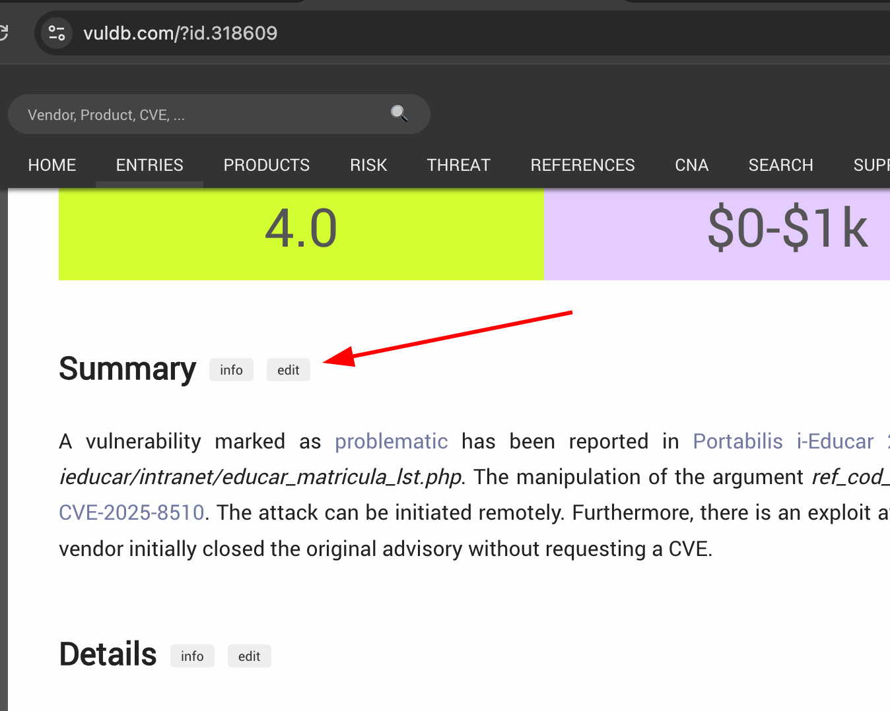

# 📤 Mini Tutorial – Submitting a Vulnerability to VulnDB

## 1️⃣ Prepare your POC

- Use the report template [VulDB](/Report%20Template%20and%20Instructions/VulnDB_Report_Template.md)
- Make a copy of the file and save it with the vulnerability name
- Prepare the detailed information according to the template
- Submit a Pull Request to our repository, placing your POC in the folder corresponding to the project

---

## 2️⃣ Submission to VulnDB

- Go to https://vuldb.com/?id.add and submit your vulnerability. (Everything must be in English)
- Remember to fill in basic information such as:
  - Vendor
  - Product
  - Version (Version where the vulnerability was tested)
  - Class (Type of vulnerability, select from the dropdown list)

---

## 3️⃣ Description
- Copy the entire content of your report stored in git and paste it into the Description field

---

## 4️⃣ Advisory / Exploit
- Provide the link to the repository containing your POC
- Select the option to request a CVE and click ADD

---

## 5️⃣ Wait for triage
- VulnDB will perform the triage

---

## 6️⃣  After publication

After receiving the email from VulnDB confirming that your CVE has been published, it is very important to log in to the platform to update the details.

The first step is to rename your file here in the repository to match the new CVE name in the format **CVE-YEAR-XXXX.md**.

Then, within the URL of your submission on VulnDB, click edit:

Edit the important fields such as:
- Advisory
  - URL (insert the updated URL with the CVE name)
  - Location: Github
  - Type: Advisory
  - VIA: CVE-Hunters
  - Person Name: your name
  - Person Nickname: your @handle
  - Person email
  - Person Website
  - Company Name: CVE-Hunters
  - Company Website: www.cvehunters.com

At the bottom of the page, submit the commit.
