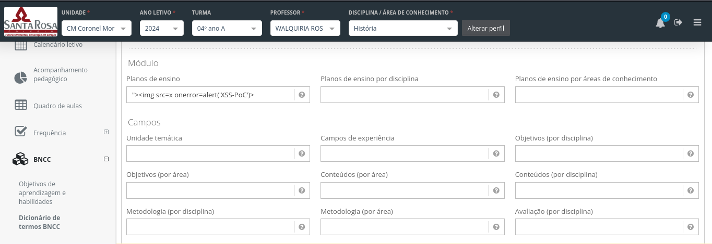

## CVE-2025-8920: Cross-Site Scripting (XSS) Storage in endpoint _dicionario-de-termos-bncc parameter Planos de ensino input field

### Summary

The application fails to properly validate and sanatize user supplied input, hence leading to a stored cross-site scripting vulnerability that resides within the Planos de ensino input field on [_/dicionario-de-termos-bncc_](https://idiario.ieducar.com.br/dicionario-de-termos-bncc)

### Details

While editing the Planos de ensino input field, which can be accessed at BNCC > Dicionário de Termos BNCC, it's possible to insert arbitrary javascript code which is then stored and executed once the user access the [Planos de ensino por disciplina](https://idiario.ieducar.com.br/planos-de-ensino-por-disciplina) and the [Planos de ensino por áreas do conhecimento](https://idiario.ieducar.com.br/planos-de-ensino-por-areas-de-conhecimento) pages.

### PoC

Firstly, the Planos de ensino field was changed and the payload `">`  was inserted. 

Secondly, once the user access the _Planos de ensino por disciplina_ and the _Planos de ensino por áreas do conhecimento_ pages the payload was triggered.

**Affected endpoint =>/dicionario-de-termos-bncc
Affected parameter => Planos de ensino**

### Impact

- Stealing session cookies: Attackers can use stolen session cookies to hijack a user's session and perform actions on their behalf.
- Downloading malware: Attackers can trick users into downloading and installing malware on their computers.
- Hijacking browsers: Attackers can hijack a user's browser or deliver browser-based exploits.
- Stealing credentials: Attackers can steal a user's credentials.
- Obtaining sensitive information: Attackers can obtain sensitive information stored in a user's account or in their browser.
- Defacing websites: Attackers can deface a website by altering its content.
- Misdirecting users: Attackers can change the instructions given to users who visit the target website, misdirecting their behavior.
- Damaging a business's reputation: Attackers can damage a business's image or spread misinformation by defacing a corporate website.

### Discoverer

([Fernanda Martins](https://github.com/FeMarb/)) (founder)

([Natan Morette](https://br.linkedin.com/in/nmmorette/pt)) (coordinator)

by [CVE-Hunters](https://github.com/Sec-Dojo-Cyber-House/cve-hunters)
